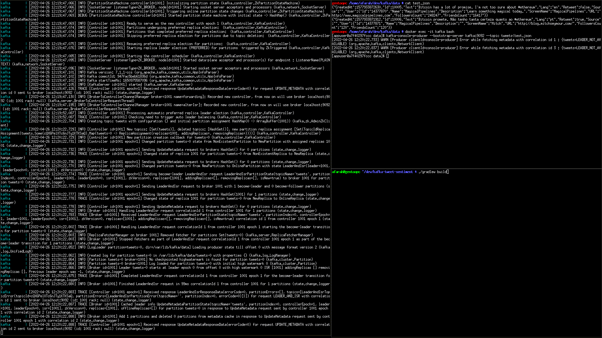
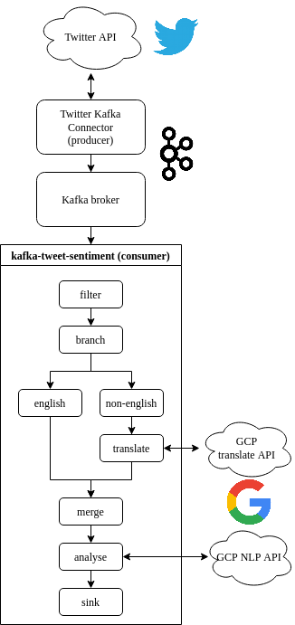

A simple tweet sentiment analysis app built to learn kafka streams. Designed
based on a sample project from O'Reilly's Mastering Kafka Streams and ksqlDB.

# Example



# Introduction

This app works as a kafka consumer performing sentiment analysis on tweets read
from a kafka topic named "tweets". Besides running this app you need a
publisher to write to the topic - which is not provided here. A suggestion is
to use a Twitter Kafka Connector such as [this
one](https://github.com/afarah/kafka-connect-twitter) (uses Twitter4j
which only supports the 1.1 API).

## Topology



# Building

```
./gradlew build
```

For a debug build pass `-Pdebug` to gradle on all tasks (`build` and `runDSL`).

# Configuration

The entities to be analysed must be specified as a comma separated list on the
`SENTIMENT_ENTITIES_LIST` environment variable. If not entities are specified, all words
in the tweets will be analysed.

The kafka broker should be specified on the `SENTIMENT_BROKER_ENDPOINT`
environment variable as `address:port`. If nothing is specified,
`localhost:9092` is used.

# Running

You can use the `docker-compose.yml` provided
[here](https://github.com/afarah/kafka-connect-twitter) to run the kafka
cluster. With the cluster running and the app configured, run:

```
./gradlew runDSL
```
